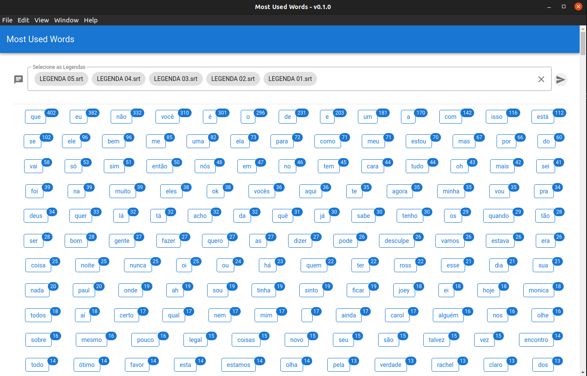

# Most Used Words

## Descrição

Projeto baseado no curso da plataforma Cod3r, [Aplicação Desktop com JavaScript, Electron JS e Vue JS](https://www.cod3r.com.br/courses/electron-vue), que tem por objetivo importar arquivos de texto de legenda e contar quantas vezes se repetem cada palavra, exibindo em ordem decrescente.
Para testar você pode utilizar os arquivos no diretório ["legendas"](./legendas).

<br>

## Prints



<br>

## Project setup

```
npm install
```

### Compiles and hot-reloads for development

```
npm run electron:dev
```

### Customize configuration

See [Configuration Reference](https://cli.vuejs.org/config/).

<br>

## Problemas durante desenvolvimento do projeto

1. ipcRenderer não funciona com em6 module:

   - Fonte: [https://github.com/nklayman/vue-cli-plugin-electron-builder/issues/683#issuecomment-600179004](https://github.com/nklayman/vue-cli-plugin-electron-builder/issues/683#issuecomment-600179004)
   - Alterar o arquivo de configuração do Vue

     ```json
         // vue.config.js
         module.exports = {
           ...
           pluginOptions: {
              electronBuilder: {
                 nodeIntegration: true,
              },
           },
        };

     ```
